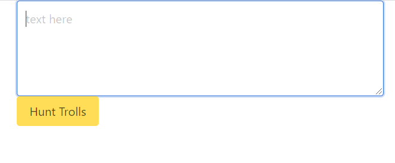

## Troll Hunter

 ## Description
 quick post sensoring app. looks for text containing specific bad words and then replaces bad word text with a line of ****

## Table of Contents
* [intsallation](#Installation)
* [usage](#Usage)
* [Technology Utilized](#Technologies)
* [contributing](#Contributing)
* [Tests](#Tests)
* [User Story](#UserStory)
* [ScreenShot](#ScreenShot)
* [Github](#Github)

## Installation
deployed on heroku or fork repo npm i and then npm start in client folder.  to install

## Usage
type some text and see if there is any bad text

## Technologies
react, express, bulma

## License
used the undefined license

## Contributing
Jacob LaMarre contributed to the design.

## Tests
try these test commands: type hello world and click hunt for trolls note nothing happens add poop to the statement and then it finds a bad word after clicking and sensors the text. 

## UserStory
AS A forum site owner
I WANT a quick way to sensor trolls
SO THAT sensor sensative posts without needing to moderate my whole site.

## ScreenShot
screenshot here!!!!!s

## Github
profile:jacobtlamarre
email: jacobtlamarre@gmail.com